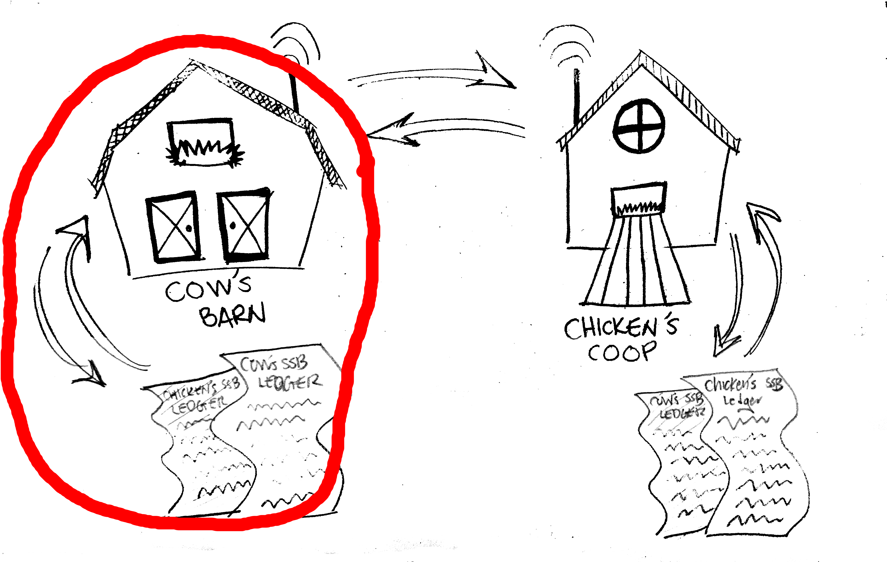
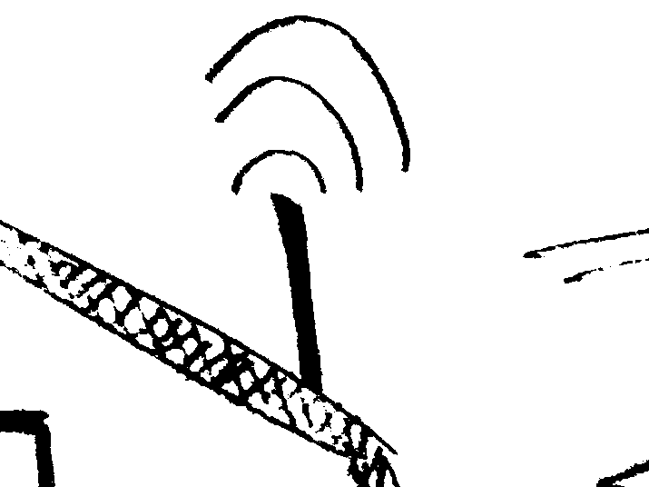
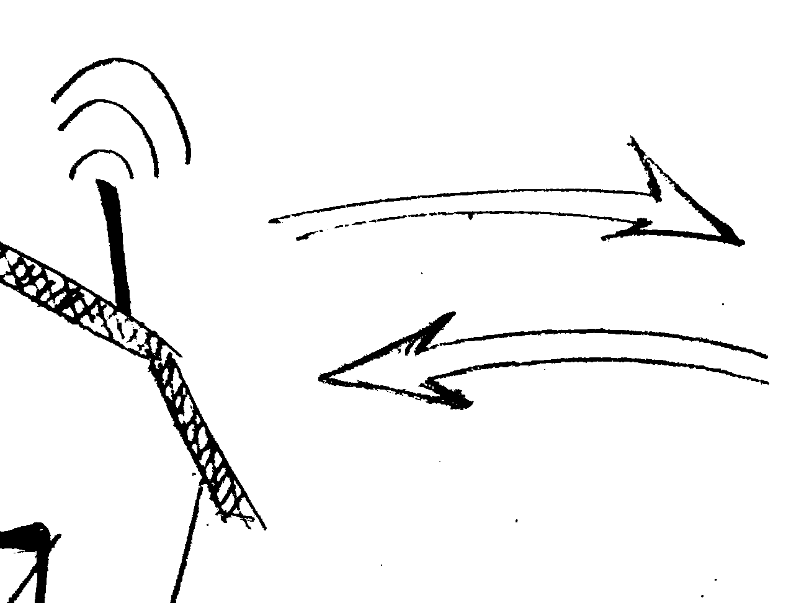
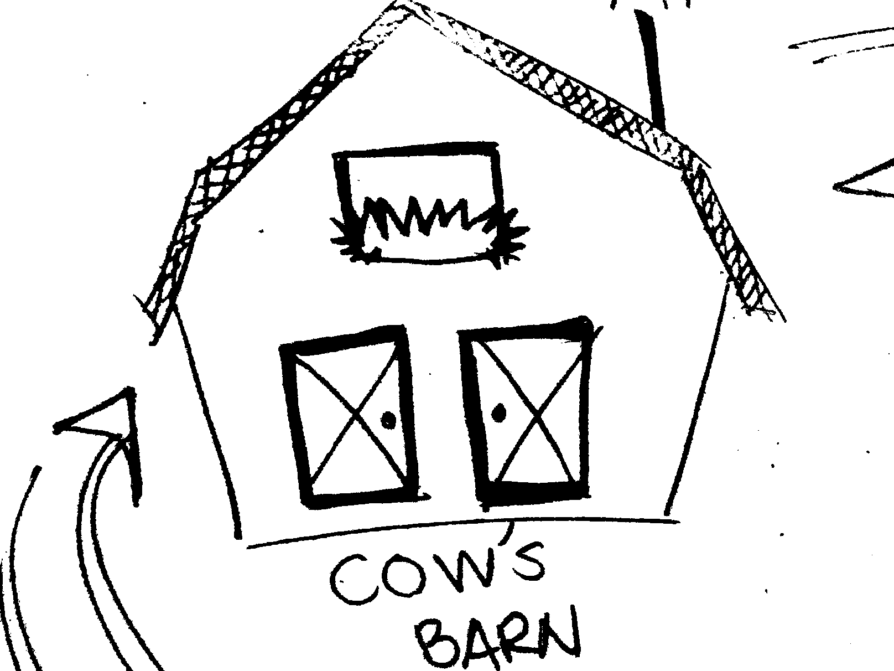
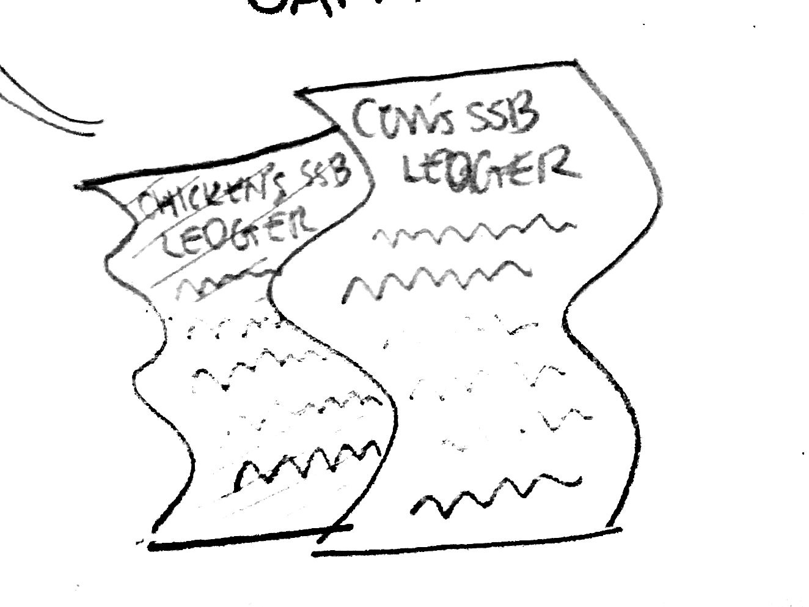

## Double congrats, you're still connected to a mesh network! You're seeing this on my (Cow's) server, which is hosted on a small computer called a Raspberry Pi. You might be connected to the wifi spot "peoplesopen.net cow" or "peoplesopen.net cow," either way you're on the mesh! 

## [Click here to connect get back to Chicken's Coop](http://100.65.26.2)

<ul class="steps columns-1">
    <li class="getnode">
        

        

            <h4>Farm Mesh</h4>
        

    </li>
</ul>

<ul class="steps columns-2">
    <li class="getnode">
        

        

            <h4>A Node</h4>
            communicates through WiFi
        

    </li>
    <li class="givenode">
        

        

            <h4>Meshing</h4>
             nodes discover each other and communicate.
        

    </li>
    <li class="meshnode">
        

        

            <h4>A Server</h4>
             to do stuff like hosting a website or sharing a ledger
        

    </li>
    <li class="buildinternet">
        

        

            <h4>A distributed message ledger</h4>
             for cow and cow to communicate
        

    </li>
</ul>

